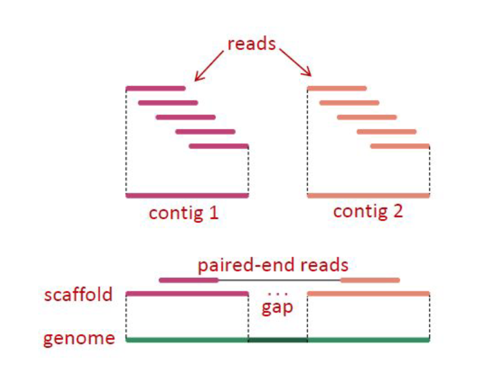

# Step 1: Setup & Introduction


<figure>
    
</figure>

#### Directory visualization
<figure>
    
    <figcaption>How the structure of our directories should look</figcaption>
</figure>

#### Command line cheat sheet
<figure>
    
</figure>

#### What does "sequence assembly" mean?
#### Assembly is a “catch-all” term used to describe methods where we combine shorter individual reads into longer contiguous sequences called contigs
#### Because the sequencing process works by breaking the original DNA into smaller fragments, the assembly process is conceptually similar to putting together an image puzzle from its many pieces
#### The software that performs the assembly is called the assembler  
#### We will learn how to *de novo* assemble reads sequenced by the Illumina sequencing platform using [SPAdes](http://cab.spbu.ru/software/spades/), an assembly toolkit containing various assembly pipelines

<figure>
    
</figure>

#### *De novo* assembly usually includes the following steps:  
1. Improving of the reads quality (remove adapters, trim reads, etc..)  
2. *De novo* assembly of the overlapping reads into contigs
3. Joining contigs into scaffolds
4. Comparison with other known genomes
5. Filling the gaps
6. Annotation of the assembled genome
7. Visualize genome annotation  

#### Challenges of *de novo* assembly
#### Sequence assembly is perhaps the application domain of bioinformatics where skill and expertise are the most difficult to identify and define   
#### Assemblers are quite unlike any other software tool you will ever use  
#### Most come with a bewildering array of parameters - the purpose of which are not explained, yet many will have profound effects on the results that they produce  
#### Trial and error are one of the most commonly used strategies - you will have to keep tuning the parameters and rerun the entire process hoping that the results improve  
#### Assembling a large genome may take weeks and substantial computational resources  
#### Thus any expertise built on trial and error will have to be accumulated over a much more extended period  
#### Finally, even when assembly appears to work, almost always it will contain several severe and substantial errors. That is where, in our opinion, bioinformatics expertise matters more  
#### The ability to understand, visualize and correct the mistakes of an assembly has a utility that will outlast the present and is more valuable than knowing the exact invocation of a tool by heart  
#### N50: length for which the collection of all contigs of that length or longer covers at least 50% of assembly length  


<figure>
    
    <figcaption>Overlapping reads are assembled into contigs. Based on the info about paired-end reads, contigs may be further assembled into scaffolds</figcaption>
</figure>


#### What is the N50 statistic:  
* A simpler explanation of N50 starts by ordering contigs by length  
* Suppose we have 10 different contigs (designated by XXXXXX ) and we ordered these by their decreasing sizes:  
  
```
Contig         Length           Sum
XXXXXXXXXX       10              10
XXXXXXXXX         9              19
XXXXXXXX          8              27
XXXXXXX           7              34
XXXXXX            6              40
XXXXX             5              45
XXXX              4              49
XXX               3              52
XX                2              54
X                 1              55
```

* The sum of these lengths starting with the longest is 55. Half of that is 27.5  
* Go down on this list and add up the lengths to find the contig where the cumulative length exceeds this half value  
* When we hit contig number 7 we have 10 + 9 + 8 + 7 = 34, this value is larger than 27.5 so it is at this point at least half of the genome is stored in contigs of size 7 or greater - N50 is then 7  
* “At least half of the nucleotides in this assembly belong to contigs of size 8bp or longer”  

#### Problems with N50 statistic:  
* One of the biggest problems using the N50 metric as the primary means of evaluating assembly quality is that it rewards “misjoins”   
* A “misjoin” is the error of concatenating separate contigs into a single segment 
* Such mistakes can happen when the evidence is insufficient, but the algorithm is tuned to be overly generous in accepting these pieces of evidence  
* Also applying cutoffs can lead to odd situations when selecting contigs would lead us to be either well under or well over the 50%  

#### What are k-mers?  
* A k-mer are all possible subsequences of size k  
* The rationale for breaking our reads into even smaller pieces, k-mers is that we want to identify “correct” k-mers, those that originate from the real data  
* The assumption is that whatever errors the reads may have these are distributed randomly - hence will produce different erroneous k-mers  
* The correct k-mers will always be the most abundant  
* In general, the longer a k-mer is, the fewer identical k-mers to it exist  
* At the same time it is also true the longer a k-mer is, the more likely is that it will contain an error  
* When it comes to assembly processes the rule of reasoning is that:
  * A larger k value allows resolving more repetitions  
  * A smaller k increases the chances of seeing a given k-mer  
* Hence the selection of a k-mer is a tradeoff between longer repeats and more reliable measures  
* In general, you should assemble sequences using the largest k-mer size possible, such that the k-mer coverage is sufficient  
* You may estimate these via trial and error (as stated above) but there are also tools that will assist you in determining the most likely k-mer sizes and coverage cutoffs  


#### Multidrug resistant bacteria have become a major public health threat  
#### Phage therapy may to be used as an alternative to antibiotics or, as a supplementary approach to treat some bacterial infections   
#### Bacteriophages have been applied in clinical practice for the treatment of localized infections in wounds, burns, and trophic ulcers, including diabetic foot ulcers (PMC6083058)  
#### In this study, bacteria were collected from trophic ulcers of the patients  
#### Bacteriophages that were successful in treating diabetic foot disease were sequenced using NGS technology   
#### The sample we will be using is a 2x250 Illumina sequenced bacteriophage  
#### The goal of this exercise is to assemble the genome of a sequenced bacteriophage  

#### [Link to data](https://doi.org/10.6084/m9.figshare.25577178.v1)

#### Making directories for lesson:

`$ mkdir -p ~/denovo_assembly/data/untrimmed_fastq ~/denovo_assembly/data/trimmed_fastq`     