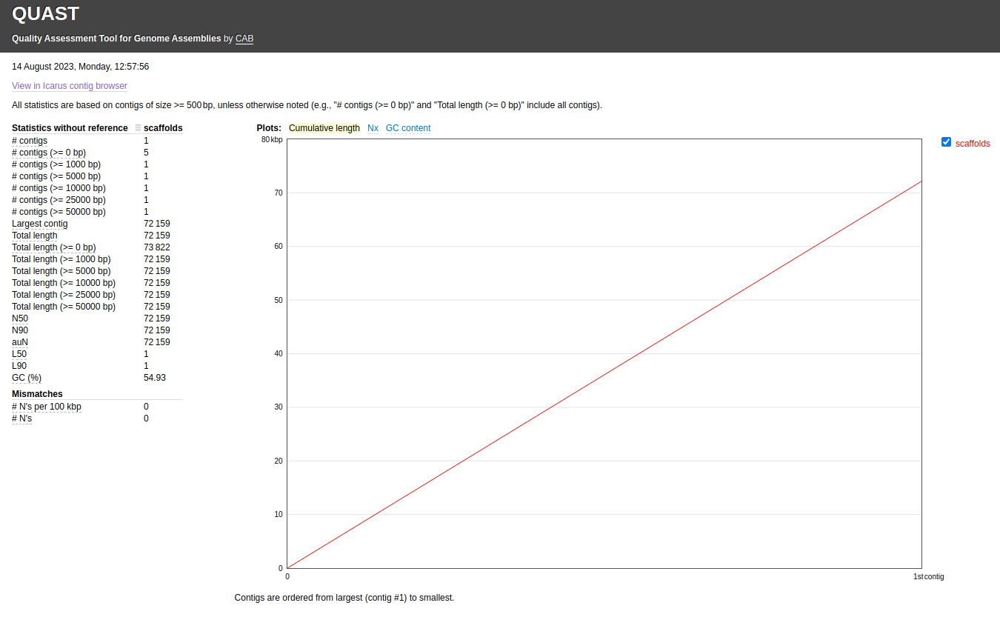

# Step 3: Sequence Assembly 

#### We will be using the program [SPades](http://cab.spbu.ru/software/spades/) for *de novo* assembly  

#### Spades will automatically make the final scaffolds:  

`$ spades.py --isolate  -1 169_S7_L001_R1_001.trim.fastq.gz -2 169_S7_L001_R2_001.trim.fastq.gz -o spades_output`   

`$ ls -l spades_output`  

#### Notice in our `spades_output` directory we have both a `contigs.fasta` and a `scaffolds.fasta`  

#### Use [QUAST](https://quast.sourceforge.net/) to analyze the SPades output scaffolds fasta file:
`$ quast.py -o quast_output spades_output/scaffolds.fasta`  

<figure>
    
    <figcaption>Result from running Quast on our scaffolds</figcaption>
</figure>

#### QUAST output contains:  
   * report.txt	- assessment summary in plain text format  
   * report.tsv	- tab-separated version of the summary, suitable for spreadsheets (Google Docs, Excel, etc)  
   * report.tex	- LaTeX version of the summary  
   * icarus.html - Icarus main menu with links to interactive viewers. See section 3.4 for details  
   * report.pdf - all other plots combined with all tables (file is created if matplotlib python library is installed)  
   * report.html - HTML version of the report with interactive plots inside  
   * contigs_reports/ - (only if a reference genome is provided)
   * misassemblies_report - detailed report on misassemblies  
   * unaligned_report - detailed report on unaligned and partially unaligned contigs  
   * k_mer_stats/ - (only if --k-mer-stats option is specified)
   * kmers_report - detailed report on k-mer-based metrics  
   * reads_stats/ - (only if reads are provided)  
   * reads_report - detailed report on mapped reads statistics  

#### SPades makes both files, but we will be using the `scaffolds.fasta` for this exercise

#### Create and move scaffolds from SPades to results directory:  

`$ mkdir -p ~/denovo_assembly/results/scaffolds`  
`$ mv ~/denovo_assembly/data/trimmed_fastq/spades_output/scaffolds.fasta ~/denovo_assembly/results/scaffolds`  
`$ cd ~/denovo_assembly/results/scaffolds`    

#### We now want to be at the `denovo_assembly` directory

---

👉 Ready? Continue to [Step 4 - Comparing the scaffolds to other known genomes]({{ "/step4/" | relative_url }})