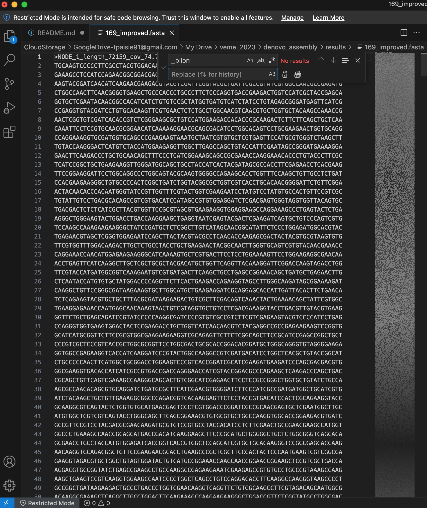

# Step 5: Filling the gaps 


#### Now we will take our scaffolds and use it as a reference as a 
#### Map the reads back to the scaffold as reference  
#### Set up BWA reference mapping with the scaffold `scaffolds.fasta` as reference and add the trimmed fastq files  

#### Make sure you are in the `denovo_assembly` directory and make `results` directories (helps with file organization, super important!!)

`$ cd ~/denovo_assembly`  
`$ mkdir -p results/sam results/bam`  

#### Index our `scaffolds.fasta` file we made with SPades:  

`$ bwa index results/scaffolds/scaffolds.fasta`  

#### Run BWA-MEM reference mapping with the indexed `scaffolds.fasta` as the reference and the original trimmed fastq files as the reads:  

```
bwa mem \
    results/scaffolds/scaffolds.fasta data/trimmed_fastq/169_S7_L001_R1_001.trim.fastq.gz \
    data/trimmed_fastq/169_S7_L001_R2_001.trim.fastq.gz \
    > results/sam/169.aligned.sam
```


#### Convert SAM file to BAM format:  
`$ samtools view -S -b results/sam/169.aligned.sam > results/bam/169.aligned.bam`  


#### Sort BAM file by coordinates:  
`$ samtools sort -o results/bam/169.aligned.sorted.bam results/bam/169.aligned.bam`  

#### Index new sorted BAM file:  
`$ samtools index results/bam/169.aligned.sorted.bam`  


#### Visualizing our new BAM file with IGV
#### We will use our `scaffolds.fasta` as the reference genome in IGV and the `169.aligned.sorted.bam` BAM file


<figure>
    
    <figcaption>IGV visualization of our genome assembly</figcaption>
</figure>


#### Now we run the program [Pilon](https://github.com/broadinstitute/pilon)

#### Pilon is a software tool which can be used to automatically improve draft assemblies  
#### It attempts to make improvements to the input genome, including:  
   * Single base differences  
   * Small Indels  
   * Larger Indels or block substitution events  
   * Gap filling
   * Identification of local misassemblies, including optional opening of new gaps

#### Pilon outputs a FASTA file containing an improved representation of the genome from the read data  

```
pilon \
    --genome results/scaffolds/scaffolds.fasta \
    --frags results/bam/169.aligned.sorted.bam \
    --output results/scaffolds/169_improved
```

 

#### This command will give us the file `169_improved.fasta`  

#### After running this commmand, each fasta input in `169_improved.fasta` has `_pilon`
#### We want to remove this `_pilon` after each fasta input
#### Open `169_improved.fasta` in a text editor

`$ code results/scaffolds/169_improved.fasta`

#### We want to "replace all" `_pilon` with nothing


<figure>
    
    <figcaption>How to edit the improved fasta file (output from pilon)</figcaption>
</figure>

---

👉 Ready? Continue to [Step 6 - Annotation of the assembled genome]({{ "/step6/" | relative_url }})