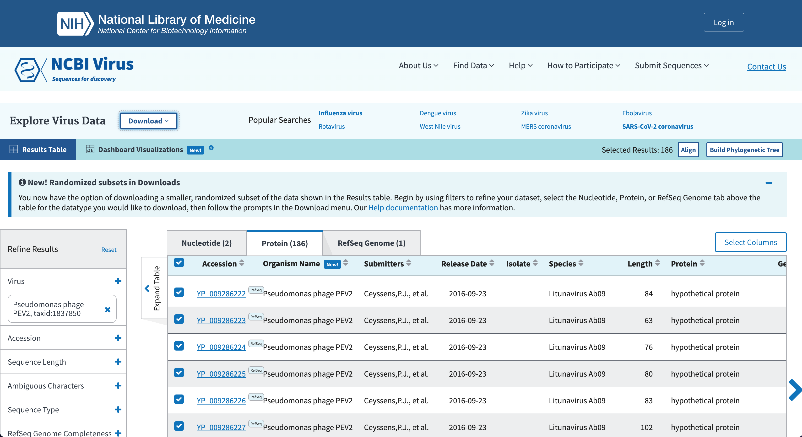

# Step 6: Annotation of the assembled genome 


#### We will use [PROKKA](https://github.com/tseemann/prokka) on the improved sequence assembly

#### After you have *de novo* assembled your genome sequencing reads into scaffolds, it is useful to know what genomic features are on those contigs  
#### The process of identifying and labelling those features is called genome annotation  
#### Prokka is a "wrapper"; it collects together several pieces of software (from various authors), and so avoids "re-inventing the wheel"  
#### Prokka finds and annotates features (both protein coding regions and RNA genes, i.e. tRNA, rRNA) present on on a sequence  
#### Prokka uses a two-step process for the annotation of protein coding regions:  
   1. Protein coding regions on the genome are identified using Prodigal  
   2. The function of the encoded protein is predicted by similarity to proteins in one of many protein or protein domain databases  
#### Prokka is a software tool that can be used to annotate bacterial, archaeal and viral genomes quickly, generating standard output files in GenBank, EMBL and gff formats

#### Once Prokka has finished, examine each of its output files:
   * The GFF and GBK files contain all of the information about the features annotated (in different formats)  
   * The .txt file contains a summary of the number of features annotated  
   * The .faa file contains the protein sequences of the genes annotated  
   * The .ffn file contains the nucleotide sequences of the genes annotated  

#### We will use a protein set specific to Pseudomonas phage PEV2 (NC_031063.1), our closely related genome from BLAST, for the annotation

#### First we want to download the [protein coding regions of the Pseudomonas phage PEV2 (NC_031063.1) genome](https://www.ncbi.nlm.nih.gov/labs/virus/vssi/#/virus?SeqType_s=Nucleotide&VirusLineage_ss=Pseudomonas%20phage%20PEV2,%20taxid:1837850), we can do this from NCBI

<figure>
    
    <figcaption>How to download a set of proteins from NCBI</figcaption>
</figure>

#### Running prokka on the improved alignment with our downloaded protein set for annotation:  

`$ mkdir -p results/annotation`  

```
wget -nv \
   https://raw.githubusercontent.com/taylorpaisie/VEME_2024_NGS_Denovo_Assembly/main/NC_031063.1.faa \
   -O ~/denovo_assembly/results/annotation/NC_031063.1.faa
```
  

#### For this tutorial we will copy the protein set we will use for annotation  


#### Need to activate the Prokka conda environment (we can talk about this later if we have time):  
 
```
prokka \
   --outdir results/annotation/prokka_output \
   --kingdom Viruses \
   --proteins results/annotation/NC_031063.1.faa \
   results/scaffolds/169_improved.fasta
```


---

👉 Ready? Continue to [Step 7 - Visualize genome annotation]({{ "/step7/" | relative_url }})