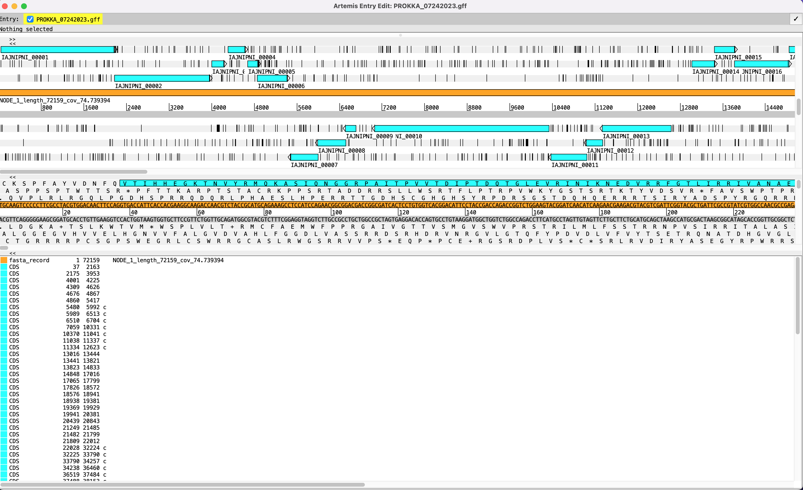

# Step 7: Visualize genome annotation

#### We will use the program Artemis to visualize the genome annotation we made with PROKKA using [Artemis](https://sanger-pathogens.github.io/Artemis/Artemis/) 
#### Artemis is a free genome browser and annotation tool that allows visualisation of sequence features, next generation data and the results of analyses within the context of the sequence, and also its six-frame translation  
#### Artemis is written in Java, and is available for UNIX, Macintosh and Windows systems  
#### It can read EMBL and GENBANK database entries or sequence in FASTA, indexed FASTA or raw format  
#### Using the GFF file made from PROKKA, we will open it with Artemis:  

`$ /usr/local/share/artemis/art results/annotation/prokka_output/PROKKA_08222023.gff`  

<figure>
    
    <figcaption>Visualizaing the genome annotation with Artemis</figcaption>
</figure>

#### Some tips for using Artemis:

1. There are 3 panels: feature map (top), sequence (middle), feature list (bottom)
2. Click right-mouse-button on bottom panel and select Show products
3. Zooming is done via the verrtical scroll bars in the two top panels